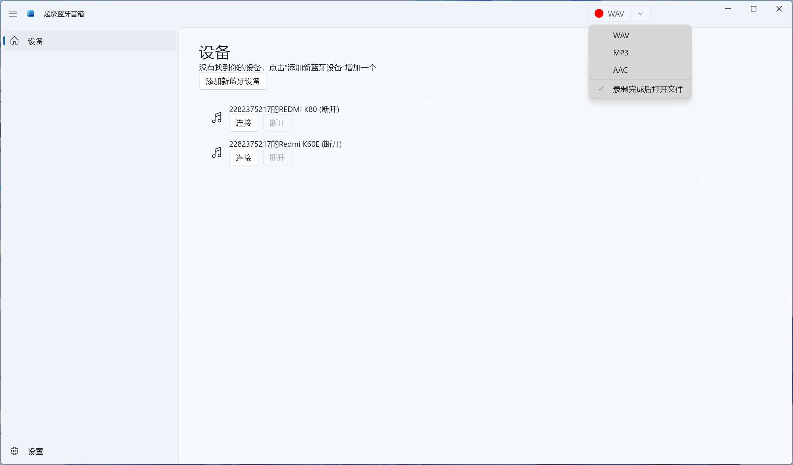
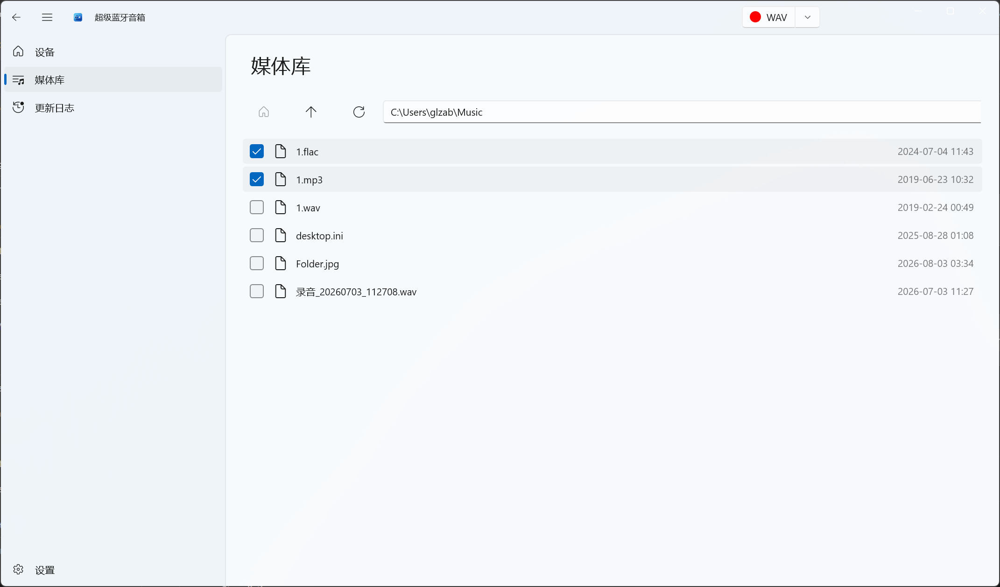
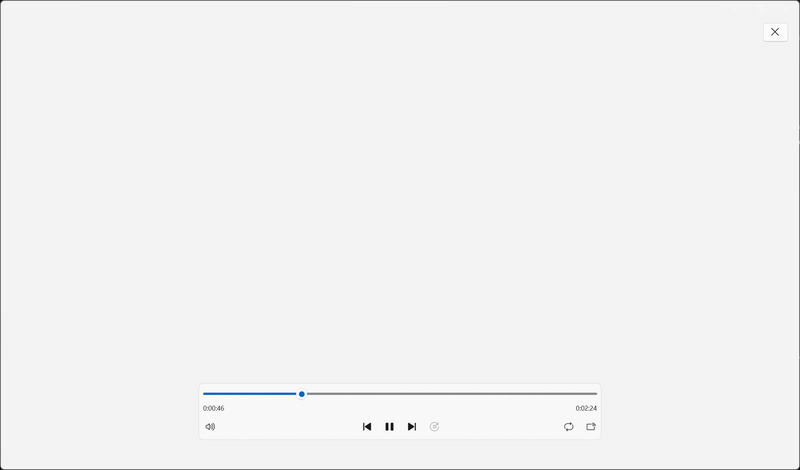

# SuperAudio

[English](README.md) · [简体中文](README.zh-CN.md) · [繁體中文](README.zh-TW.md)

**超级蓝牙音箱** —— 把电脑变成蓝牙音箱，接收手机等设备的音频，并录制系统声音。

[](https://get.microsoft.com/installer/download/9ngsn37k2gcc?referrer=appbadge)

## 项目简介

SuperAudio 是一款轻量级 Windows 桌面应用，让你的电脑变身为一台**蓝牙音箱（音频接收端）**：手机、平板等设备的音乐或任意音频，都能通过蓝牙直接推送到电脑的扬声器或耳机播放。在此基础上，SuperAudio 还集成了**系统音频录制（Loopback）**、**本地媒体库**与**内置播放器**，是一站式音频助手。

点击上方徽章，即可从微软商店下载安装 SuperAudio。

## 界面截图

### 主界面（设备管理 / 蓝牙接收）



### 媒体库



### 播放



## 功能特性

### 核心功能

- 🎵 **音频设备管理**：自动检测并管理系统音频播放设备
- 🔗 **音频播放连接**：启用 / 释放蓝牙音频接收连接
- 📱 **设备监控**：实时跟踪音频设备的插拔状态
- 🔌 **热插拔支持**：设备插拔时自动刷新设备列表
- 🎙️ **系统音频录制（Loopback）**：捕获系统输出音频流，并选择输出格式
- 📂 **媒体库管理**：浏览本地音乐文件夹，管理音频文件
- ▶️ **内置播放器**：提供应用内音频播放体验

### 界面特性

- 🎨 **原生 Windows 11 风格**：基于 WinUI 3 构建的现代界面
- 🌙 **主题切换**：支持深色 / 浅色 / 跟随系统
- 📺 **流畅动画**：流畅的过渡与交互
- 🧭 **导航模式**：支持左侧导航栏与顶部导航栏

### 系统集成

- ⚙️ **设置持久化**：通过 ApplicationData 或 JSON 两种 Provider 保存用户偏好
- 🔲 **窗口管理**：最小化、调整大小等
- 📌 **跳转列表**：支持 Windows 任务栏跳转列表
- 🌐 **多语言支持**：自动 + 13 种语言 —— English、简体中文、繁體中文（台灣）、繁體中文（香港）、简体中文（新加坡）、日本語、한국어、Français、Deutsch、Español、Italiano、Português (Brasil)、Русский

## 技术栈

| | |
|---|---|
| 框架 | WinUI 3（Windows App SDK 2.2.0） |
| 编程语言 | C# / .NET 10 |
| 目标系统 | Windows 10（1809 / build 17763）及以上，含 Windows 11 |
| 目标架构 | x86、x64、ARM64 |
| 架构模式 | MVVM（CommunityToolkit.Mvvm 8.4.2） |
| 关键依赖 | NAudio 2.3.0、WinUIEx 2.9.1、CommunityToolkit.WinUI.Controls.SettingsControls |

## 项目结构

```
SuperAudio/
├── Assets/                # 应用资源（图标、启动画面、磁贴）
├── Converters/            # 值转换器
├── Helpers/               # 辅助工具类
│   ├── AppLifeHelper.cs
│   ├── EnumHelper.cs
│   ├── ExplorerHelper.cs
│   ├── JumpListHelper.cs
│   ├── NativeMethods.cs
│   ├── NavigationHelper.cs
│   ├── NavigationOrientationHelper.cs
│   ├── ProcessInfoHelper.cs
│   ├── SettingsHelper/
│   ├── SuspensionManager.cs
│   ├── ThemeHelper.cs
│   ├── TitleBarHelper.cs
│   ├── UIHelper.cs
│   └── WindowHelper.cs
├── Pages/                 # 页面
│   ├── HomePage.xaml(.cs)        # 首页（设备管理）
│   ├── MediaLibraryPage.xaml(.cs) # 媒体库
│   ├── PlayerPage.xaml(.cs)      # 播放
│   ├── SettingsPage.xaml(.cs)    # 设置
│   └── ChangelogPage.xaml(.cs)   # 更新日志 / 新版说明
├── Services/              # 服务层
│   ├── LoopbackRecorder.cs      # 音频录制
│   ├── PlayerInfoItem.cs        # 音频设备项模型
│   └── PlayerService.cs         # 音频播放服务
├── ViewModels/            # 视图模型
│   ├── HomePageViewModel.cs
│   ├── MediaLibraryPageViewModel.cs
│   ├── PlayerPageViewModel.cs
│   ├── SettingsViewModel.cs
│   └── MainWindowViewModel.cs
├── Strings/               # 国际化资源（13 种语言）
│   ├── en-US/  zh-CN/  zh-TW/  zh-HK/  zh-SG/
│   └── ja-JP/  ko-KR/  fr-FR/  de-DE/  es-ES/  it-IT/  pt-BR/  ru-RU/
├── App.xaml(.cs)          # 应用入口
├── MainWindow.xaml(.cs)   # 主窗口
└── SuperAudio.csproj      # 项目文件
```

## 系统要求

- Windows 10（1809 / build 17763）及以上，含 Windows 11
- 从源码构建需：Visual Studio 2022，并安装 **.NET 桌面开发** 与 **Windows 应用开发**（含 WinUI 3）工作负载

## 构建与运行

1. 安装 **Visual Studio 2022**（或更高版本）
2. 添加工作负载：**NET 桌面开发** 与 **Windows 应用开发**（含 WinUI 3）
3. 克隆仓库
4. 用 Visual Studio 打开 `SuperAudio.slnx`
5. 选择目标架构（**x64** / **ARM64** / **x86**）
6. 按 `F5`（或点击运行）启动应用

### 生成发布包

1. 将解决方案配置切换为 **Release**
2. 选择目标架构（x64 / ARM64 / x86）
3. 右键项目 → **发布**，按向导生成 MSIX 包

## 核心模块

### 辅助类（Helpers）

| 辅助类 | 功能说明 |
|--------|----------|
| `AppLifeHelper` | 应用生命周期管理 / 重启 |
| `NavigationHelper` | 页面导航与状态（返回 / 前进） |
| `SettingsHelper` | 设置持久化（ApplicationData / JSON） |
| `ThemeHelper` | 主题切换（深色 / 浅色 / 跟随系统） |
| `WindowHelper` | 窗口创建与追踪 |
| `SuspensionManager` | 会话状态保存与还原 |
| `UIHelper` | UI 元素查找与辅助功能 |
| `TitleBarHelper` | 标题栏样式与系统主题适配 |
| `ProcessInfoHelper` | 进程信息与版本获取 |
| `NativeMethods` | Windows 原生 API 调用 / 窗口消息 |
| `JumpListHelper` | 任务栏跳转列表管理 |
| `NavigationOrientationHelper` | 导航方向（侧边 / 顶部） |
| `ExplorerHelper` | 在文件资源管理器中定位文件 |

### 页面（Pages）

- **HomePage**：首页，提供音频设备管理与播放连接
- **MediaLibraryPage**：媒体库，浏览与管理本地音乐
- **PlayerPage**：播放页，提供播放控制
- **SettingsPage**：设置页，包含主题、语言、导航等
- **ChangelogPage**：更新日志 / 新版说明

### 服务（Services）

- **PlayerService**：音频播放服务；设备生命周期、连接管理、热插拔支持
- **PlayerInfoItem**：音频设备项模型（信息、连接状态、启用 / 释放）
- **LoopbackRecorder**：捕获系统音频输出，存为 WAV，管理录音任务

### 视图模型（ViewModels）

- **MainWindowViewModel**：主窗口状态、标题、录音控制与格式选择
- **HomePageViewModel**：设备列表与连接状态
- **MediaLibraryPageViewModel**：文件列表、路径导航、文件操作
- **PlayerPageViewModel**：播放列表与播放状态
- **SettingsViewModel**：应用设置

## 使用说明

### 音频设备管理

1. 启动后，首页会自动列出可用的音频播放设备
2. 点击设备对应的「连接」按钮启用音频接收连接
3. 点击「释放」按钮断开连接
4. 设备列表会实时更新，插拔设备时自动刷新

### 系统音频录制

1. 在主界面点击录音按钮开始录制系统音频
2. 选择录音格式（如 WAV）
3. 录制完成后，可在媒体库中查看与管理录音文件

### 媒体库管理

1. 进入媒体库页面浏览本地音乐文件夹
2. 支持双击播放音频文件
3. 支持在文件资源管理器中打开文件位置

### 设置配置

1. 进入设置页面（点击导航栏设置图标）
2. 可配置选项包括：
   - **主题模式**：自动 / 浅色 / 深色
   - **语言**：自动 / 13 种语言（详见上方）
   - **导航位置**：侧边栏 / 顶部

## 许可证

详见仓库中的 [LICENSE](LICENSE) 文件。
