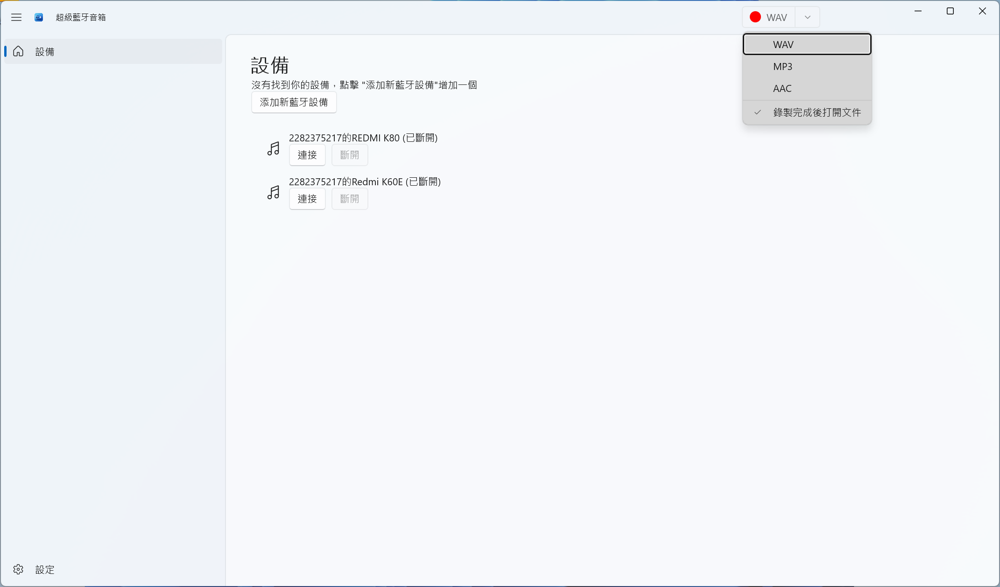
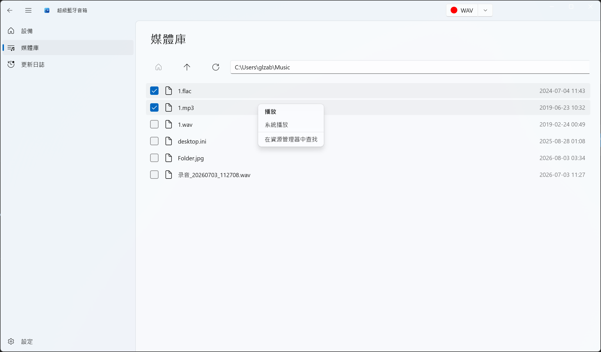

# SuperAudio

[English](README.md) · [简体中文](README.zh-CN.md) · [繁體中文](README.zh-TW.md)

**超級藍牙音箱** —— 把電腦變成藍牙音箱，接收手機等裝置的音訊，並錄製系統聲音。

[](https://get.microsoft.com/installer/download/9ngsn37k2gcc?referrer=appbadge)

## 專案簡介

SuperAudio 是一款輕量級 Windows 桌面應用，讓你的電腦變身為一台**藍牙音箱（音訊接收端）**：手機、平板等裝置的音樂或任意音訊，都能透過藍牙直接推送到電腦的喇叭或耳機播放。在此基礎上，SuperAudio 還整合了**系統音訊錄製（Loopback）**、**本機媒體庫**與**內建播放器**，是一站式音訊助手。

點擊上方徽章，即可從 Microsoft Store 下載安裝 SuperAudio。

## 介面截圖

### 主介面（裝置管理 / 藍牙接收）



### 媒體庫



### 播放


## 功能特性

### 核心功能

- 🎵 **音訊裝置管理**：自動偵測並管理系統音訊播放裝置
- 🔗 **音訊播放連線**：啟用 / 釋放藍牙音訊接收連線
- 📱 **裝置監控**：即時追蹤音訊裝置的插拔狀態
- 🔌 **熱插拔支援**：裝置插拔時自動重新整理裝置清單
- 🎙️ **系統音訊錄製（Loopback）**：擷取系統輸出的音訊串流，並選擇輸出格式
- 📂 **媒體庫管理**：瀏覽本機音樂資料夾，管理音訊檔案
- ▶️ **內建播放器**：提供應用程式內的音訊播放體驗

### 介面特性

- 🎨 **原生 Windows 11 風格**：基於 WinUI 3 建構的現代介面
- 🌙 **主題切換**：支援深色 / 淺色 / 跟隨系統
- 📺 **流暢動畫**：流暢的轉場與互動
- 🧭 **導覽模式**：支援左側導覽列與頂部導覽列

### 系統整合

- ⚙️ **設定持久化**：透過 ApplicationData 或 JSON 兩種 Provider 儲存使用者偏好
- 🔲 **視窗管理**：最小化、調整大小等
- 📌 **跳躍清單**：支援 Windows 工作列跳躍清單
- 🌐 **多語言支援**：自動 + 13 種語言 —— English、簡體中文、繁體中文（台灣）、繁體中文（香港）、簡體中文（新加坡）、日本語、한국어、Français、Deutsch、Español、Italiano、Português (Brasil)、Русский

## 技術堆疊

| | |
|---|---|
| 框架 | WinUI 3（Windows App SDK 2.2.0） |
| 程式語言 | C# / .NET 10 |
| 目標系統 | Windows 10（1809 / build 17763）及以上，含 Windows 11 |
| 目標架構 | x86、x64、ARM64 |
| 架構模式 | MVVM（CommunityToolkit.Mvvm 8.4.2） |
| 關鍵依賴 | NAudio 2.3.0、WinUIEx 2.9.1、CommunityToolkit.WinUI.Controls.SettingsControls |

## 專案結構

```
SuperAudio/
├── Assets/                # 應用程式資源（圖示、啟動畫面、磚瓦）
├── Converters/            # 值轉換器
├── Helpers/               # 輔助工具類
│   ├── AppLifeHelper.cs
│   ├── EnumHelper.cs
│   ├── ExplorerHelper.cs
│   ├── JumpListHelper.cs
│   ├── NativeMethods.cs
│   ├── NavigationHelper.cs
│   ├── NavigationOrientationHelper.cs
│   ├── ProcessInfoHelper.cs
│   ├── SettingsHelper/
│   ├── SuspensionManager.cs
│   ├── ThemeHelper.cs
│   ├── TitleBarHelper.cs
│   ├── UIHelper.cs
│   └── WindowHelper.cs
├── Pages/                 # 頁面
│   ├── HomePage.xaml(.cs)        # 首頁（裝置管理）
│   ├── MediaLibraryPage.xaml(.cs) # 媒體庫
│   ├── PlayerPage.xaml(.cs)      # 播放
│   ├── SettingsPage.xaml(.cs)    # 設定
│   └── ChangelogPage.xaml(.cs)   # 更新日誌 / 新版說明
├── Services/              # 服務層
│   ├── LoopbackRecorder.cs      # 音訊錄製
│   ├── PlayerInfoItem.cs        # 音訊裝置項目模型
│   └── PlayerService.cs         # 音訊播放服務
├── ViewModels/            # 檢視模型
│   ├── HomePageViewModel.cs
│   ├── MediaLibraryPageViewModel.cs
│   ├── PlayerPageViewModel.cs
│   ├── SettingsViewModel.cs
│   └── MainWindowViewModel.cs
├── Strings/               # 國際化資源（13 種語言）
│   ├── en-US/  zh-CN/  zh-TW/  zh-HK/  zh-SG/
│   └── ja-JP/  ko-KR/  fr-FR/  de-DE/  es-ES/  it-IT/  pt-BR/  ru-RU/
├── App.xaml(.cs)          # 應用程式進入點
├── MainWindow.xaml(.cs)   # 主視窗
└── SuperAudio.csproj      # 專案檔
```

## 系統需求

- Windows 10（1809 / build 17763）及以上，含 Windows 11
- 從原始碼建置需：Visual Studio 2022，並安裝 **.NET 桌面開發** 與 **Windows 應用程式開發**（含 WinUI 3）工作負載

## 建置與執行

1. 安裝 **Visual Studio 2022**（或更高版本）
2. 加入工作負載：**NET 桌面開發** 與 **Windows 應用程式開發**（含 WinUI 3）
3. 複製倉庫
4. 用 Visual Studio 開啟 `SuperAudio.slnx`
5. 選擇目標架構（**x64** / **ARM64** / **x86**）
6. 按 `F5`（或點擊執行）啟動應用程式

### 產生發行套件

1. 將解決方案組態切換為 **Release**
2. 選擇目標架構（x64 / ARM64 / x86）
3. 右鍵點擊專案 → **發行**，依精靈產生 MSIX 套件

## 核心模組

### 輔助類（Helpers）

| 輔助類 | 功能說明 |
|--------|----------|
| `AppLifeHelper` | 應用程式生命週期管理 / 重新啟動 |
| `NavigationHelper` | 頁面導覽與狀態（返回 / 前進） |
| `SettingsHelper` | 設定持久化（ApplicationData / JSON） |
| `ThemeHelper` | 主題切換（深色 / 淺色 / 跟隨系統） |
| `WindowHelper` | 視窗建立與追蹤 |
| `SuspensionManager` | 工作階段狀態儲存與還原 |
| `UIHelper` | UI 元素查找與協助工具 |
| `TitleBarHelper` | 標題列樣式與系統主題適配 |
| `ProcessInfoHelper` | 程序資訊與版本取得 |
| `NativeMethods` | Windows 原生 API 呼叫 / 視窗訊息 |
| `JumpListHelper` | 工作列跳躍清單管理 |
| `NavigationOrientationHelper` | 導覽方向（側邊 / 頂部） |
| `ExplorerHelper` | 在檔案總管中定位檔案 |

### 頁面（Pages）

- **HomePage**：首頁，提供音訊裝置管理與播放連線
- **MediaLibraryPage**：媒體庫，瀏覽與管理本機音樂
- **PlayerPage**：播放頁，提供播放控制
- **SettingsPage**：設定頁，包含主題、語言、導覽等
- **ChangelogPage**：更新日誌 / 新版說明

### 服務（Services）

- **PlayerService**：音訊播放服務；裝置生命週期、連線管理、熱插拔支援
- **PlayerInfoItem**：音訊裝置項目模型（資訊、連線狀態、啟用 / 釋放）
- **LoopbackRecorder**：擷取系統音訊輸出，存為 WAV，管理錄音工作

### 檢視模型（ViewModels）

- **MainWindowViewModel**：主視窗狀態、標題、錄音控制與格式選擇
- **HomePageViewModel**：裝置清單與連線狀態
- **MediaLibraryPageViewModel**：檔案清單、路徑導覽、檔案操作
- **PlayerPageViewModel**：播放清單與播放狀態
- **SettingsViewModel**：應用程式設定

## 使用說明

### 音訊裝置管理

1. 啟動後，首頁會自動列出可用的音訊播放裝置
2. 點擊裝置對應的「連線」按鈕啟用音訊接收連線
3. 點擊「釋放」按鈕斷開連線
4. 裝置清單會即時更新，插拔裝置時自動重新整理

### 系統音訊錄製

1. 在主介面點擊錄音按鈕開始錄製系統音訊
2. 選擇錄音格式（如 WAV）
3. 錄製完成後，可在媒體庫中檢視與管理錄音檔

### 媒體庫管理

1. 進入媒體庫頁面瀏覽本機音樂資料夾
2. 支援雙擊播放音訊檔
3. 支援在檔案總管中開啟檔案位置

### 設定配置

1. 進入設定頁面（點擊導覽列設定圖示）
2. 可配置選項包括：
   - **主題模式**：自動 / 淺色 / 深色
   - **語言**：自動 / 13 種語言（詳見上方）
   - **導覽位置**：側邊欄 / 頂部

## 授權

請參閱倉庫中的 [LICENSE](LICENSE) 檔案。
